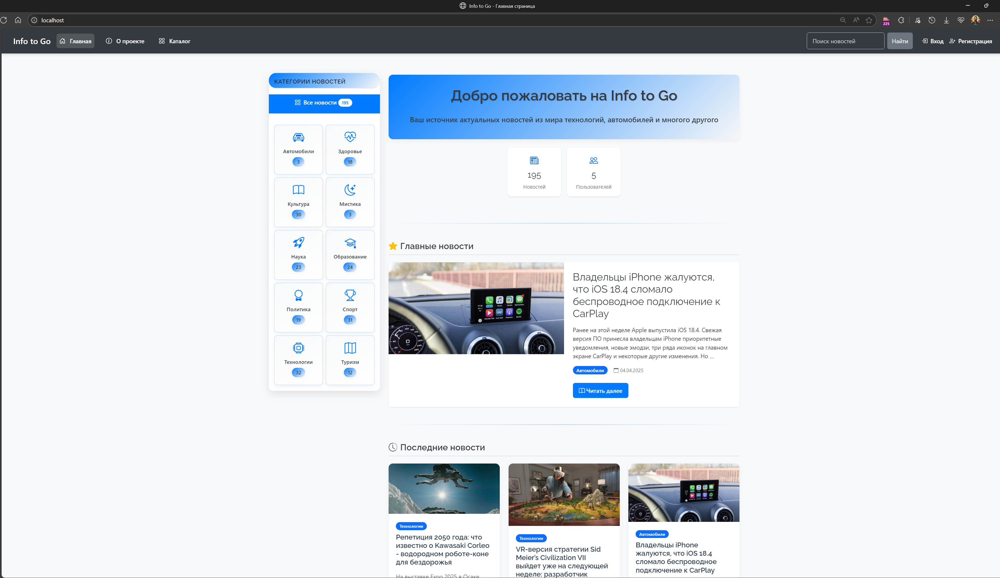
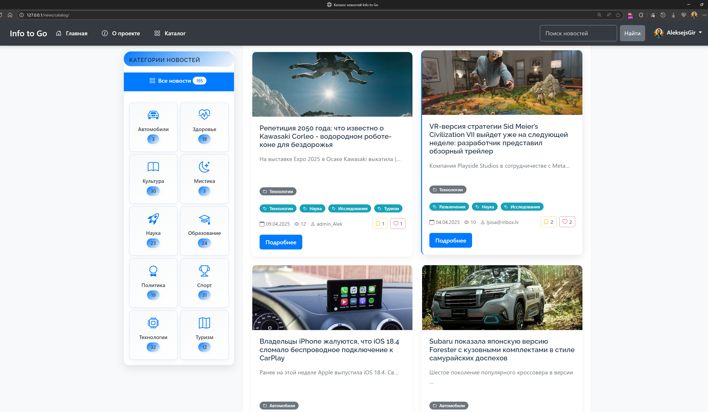
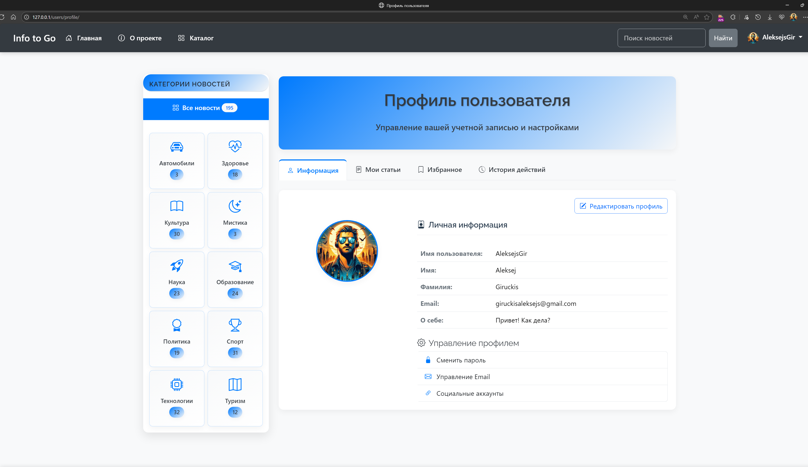
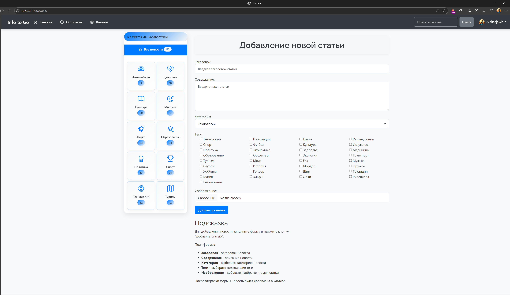

# 📰 Info to Go - Django News Portal

> A modern, fully-featured news portal built with Django, featuring user authentication, content management, and social features. Perfect for staying updated with the latest technology news.


## 📸 Screenshots

### Homepage with Category Sidebar

*Clean, modern interface with categorized news and intuitive navigation*

### News Catalog with Sorting

*Advanced filtering and sorting options for better content discovery*

### User Profile Management

*Comprehensive user profile with activity tracking and content management*

### Article Creation Form

*User-friendly article creation with rich text editor and media upload*


## ✨ Key Features

### 🔐 User Management
- **Multi-Authentication**: Email/password and GitHub OAuth integration
- **User Profiles**: Comprehensive profile management with activity tracking
- **Permission System**: Role-based access control for content management

### 📝 Content Management
- **Article Creation**: Rich text editor with media upload capabilities
- **Categories & Tags**: Hierarchical content organization system
- **Advanced Filtering**: Sort by date, popularity, and category
- **Pagination**: Efficient content loading with 15 items per page

### 💫 Social Features
- **Like System**: Users can like/unlike articles
- **Favorites**: Bookmark articles for later reading
- **Activity History**: Track user interactions and engagement
- **Comment System**: Interactive discussions on articles *(if implemented)*

### 🎨 Modern UI/UX
- **Responsive Design**: Bootstrap 5 for mobile-first approach
- **Clean Interface**: Professional design with intuitive navigation
- **Dark/Light Theme**: User preference customization *(if implemented)*
- **Fast Loading**: Optimized queries and efficient pagination

## 🛠️ Technology Stack

### Backend
- **Python 3.10+** - Core programming language
- **Django 4.2+** - Web framework with MVT architecture
- **Django Allauth** - Authentication system with social login
- **Jazzmin** - Enhanced admin interface

### Database
- **PostgreSQL 13+** - Primary database with advanced features
- **Django ORM** - Object-relational mapping for database operations

### Frontend
- **Bootstrap 5** - Responsive CSS framework
- **JavaScript ES6+** - Interactive functionality
- **Django Templates** - Server-side rendering

### DevOps & Deployment
- **Docker & Docker Compose** - Containerization and orchestration
- **Nginx** - Reverse proxy and static file serving
- **Gunicorn** - WSGI HTTP server for production

### Development Tools
- **Git** - Version control
- **VS Code** - Development environment
- **PostgreSQL Admin** - Database management

## 🏗️ Architecture

```
┌─────────────────┐    ┌─────────────────┐    ┌─────────────────┐
│     Nginx       │    │     Django      │    │   PostgreSQL    │
│   (Reverse      │◄──►│   Application   │◄──►│    Database     │
│     Proxy)      │    │     Server      │    │                 │
└─────────────────┘    └─────────────────┘    └─────────────────┘
         │                       │                       │
         │                       │                       │
    Static Files            Business Logic          Data Storage
     & Media                 & Templates            & Relations
```

## 🚀 Quick Start

### Prerequisites
- [Docker](https://www.docker.com/get-started) 20.10+
- [Docker Compose](https://docs.docker.com/compose/install/) 2.0+
- [Git](https://git-scm.com/) 2.30+

### Installation

1. **Clone the repository**
   ```bash
   git clone https://github.com/AleksejsGir/Info_to_Go-news_portal.git
   cd Info_to_Go-news_portal
   ```

2. **Configure environment variables**
   ```bash
   cp .env.example .env
   # Edit .env with your configuration
   ```

3. **Build and start services**
   ```bash
   docker-compose build
   docker-compose up -d
   ```

4. **Access the application**
   - **Main Site**: http://localhost
   - **Admin Panel**: http://localhost/admin/
   - **Default Admin**: Username and password from `.env` file

### Development Commands

```bash
# View logs
docker-compose logs -f web

# Run Django commands
docker exec -it itg_django_web python manage.py <command>

# Access Django shell
docker exec -it itg_django_web python manage.py shell

# Run tests
docker exec -it itg_django_web python manage.py test

# Create superuser
docker exec -it itg_django_web python manage.py createsuperuser
```

## 📋 Environment Configuration

### Required Environment Variables

```env
# Django Settings
SECRET_KEY=your-secret-key-here
DEBUG=True
DJANGO_ALLOWED_HOSTS=localhost,127.0.0.1,nginx
DJANGO_SITE_DOMAIN=localhost

# Database
PG_PASSWORD=your-postgres-password

# Email Configuration
EMAIL_HOST=smtp.gmail.com
EMAIL_PORT=587
EMAIL_USE_TLS=True
EMAIL_HOST_USER=your-email@gmail.com
EMAIL_HOST_PASSWORD=your-app-password

# GitHub OAuth
CLIENT_ID=your-github-client-id
CLIENT_SECRET=your-github-client-secret

# Admin User
DJANGO_SUPERUSER_USERNAME=admin
DJANGO_SUPERUSER_EMAIL=admin@example.com
DJANGO_SUPERUSER_PASSWORD=your-admin-password
```

## 🎯 Project Highlights

### Technical Achievements
- **Scalable Architecture**: Microservices approach with Docker containers
- **Security Best Practices**: CSRF protection, secure authentication, environment variables
- **Performance Optimization**: Database query optimization, efficient pagination
- **Code Quality**: Clean code principles, proper Django project structure

### Business Features
- **Content Management**: Complete CRUD operations for articles
- **User Engagement**: Social features to increase user retention
- **Admin Interface**: Intuitive admin panel for content moderation
- **SEO Friendly**: Proper URL structure and metadata management

## 🧪 Testing

```bash
# Run all tests
docker exec -it itg_django_web python manage.py test

# Run specific app tests
docker exec -it itg_django_web python manage.py test news

# Run with coverage
docker exec -it itg_django_web coverage run --source='.' manage.py test
docker exec -it itg_django_web coverage report
```

## 📈 Future Enhancements

- [ ] **Search Functionality**: Elasticsearch integration for advanced search
- [ ] **API Development**: REST API with Django REST Framework
- [ ] **Real-time Features**: WebSocket integration for live updates
- [ ] **Analytics Dashboard**: User engagement and content performance metrics
- [ ] **Mobile App**: React Native mobile application
- [ ] **AI Features**: Content recommendation system
- [ ] **Multilingual Support**: Internationalization (i18n) implementation

## 🤝 Contributing

Contributions are welcome! Please feel free to submit a Pull Request. For major changes, please open an issue first to discuss what you would like to change.

1. Fork the repository
2. Create your feature branch (`git checkout -b feature/AmazingFeature`)
3. Commit your changes (`git commit -m 'Add some AmazingFeature'`)
4. Push to the branch (`git push origin feature/AmazingFeature`)
5. Open a Pull Request

## 📄 License

This project is licensed under the Apache License 2.0 - see the [LICENSE](LICENSE) file for details.

## 👨‍💻 Author

<div align="center">
  <table>
    <tr>
      <td align="center">
        <a href="https://github.com/AleksejsGir">
          
          <br />
          <sub><b>Aleksejs Giruckis</b></sub>
        </a>
        <br />
        <sub>Full-Stack Developer</sub>
        <br />
        <a href="https://github.com/AleksejsGir">GitHub</a> •
        <a href="mailto:aleksej.it.gir@gmail.com">Email</a> •
        <a href="www.linkedin.com/in/aleksejs-giruckis-0569a7353">LinkedIn</a>
      </td>
    </tr>
  </table>
</div>

---

<div align="center">
  <p>⭐ If you found this project helpful, please give it a star!</p>
  <p>🚀 <strong>Available for hire</strong> - Open to new opportunities in the UK</p>
</div>